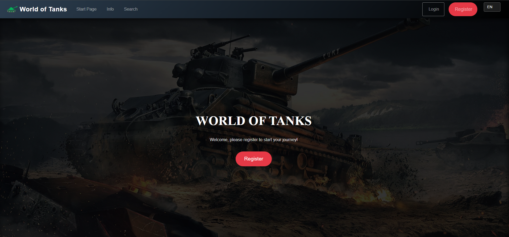
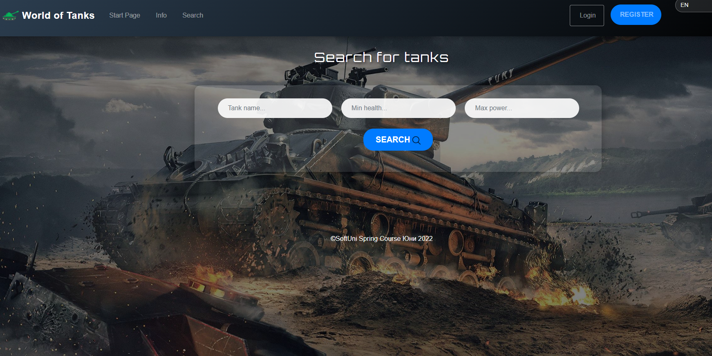
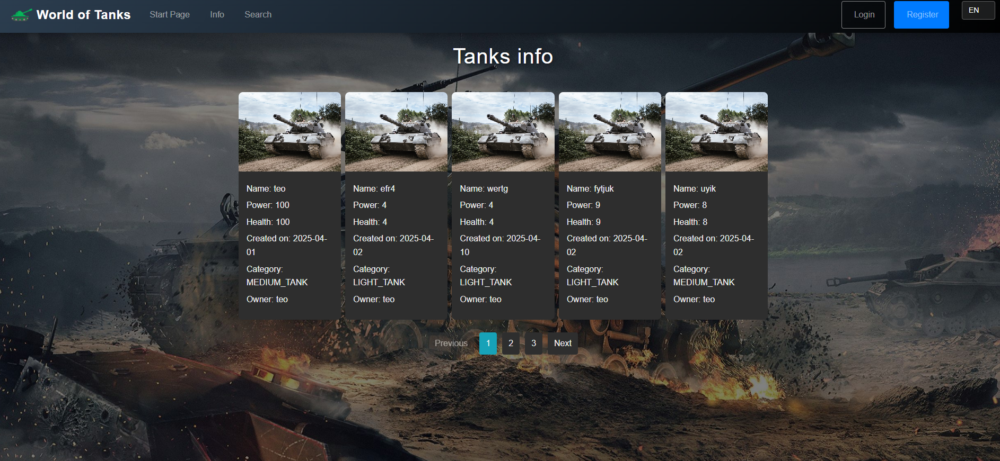
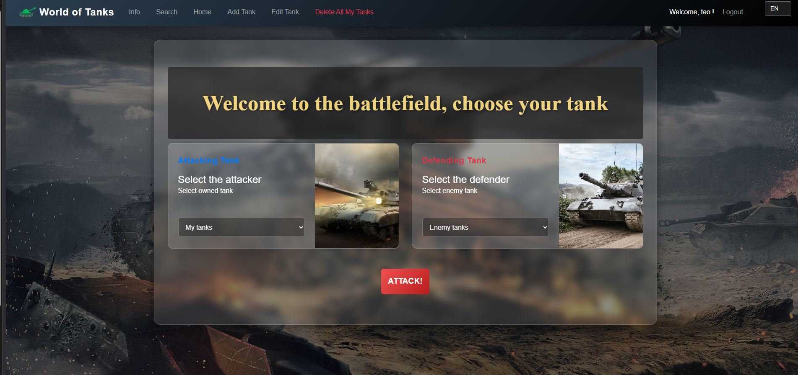

# World of Tanks 🎮

[](https://java.com)
[](https://spring.io)
[](https://testing.com)

A Spring Boot web application for tank enthusiasts to battle with style! Featuring secure authentication, real-time gameplay mechanics, and a responsive design.

---

## Screenshots

Get a quick look at the application's key pages:

### Start Page


### Search Page


### Info Page


### Home Page


---

## 🚀 Features

### Technical Stack
- **MySQL Database** with JPA/Hibernate integration
- **Spring Security** with role-based access (ADMIN/USER)
- **Dockerized SMTP Server** (MailHog) for email testing
- Model Mapper for DTO conversions
- Maintenance Interceptor for system updates
- Scheduler for automated tasks

### Validation & Security
- Client/Server-side form validation
- Localization Interceptor for multi-language support
- Logging Interceptor for request tracking

### Gameplay Mechanics
- Tank category-based **bonus damage system** ⚔️
- Responsive UI for all device sizes 📱💻

### Testing
- 63% line coverage with JUnit/Mockito
- Comprehensive exception handling

---

## ⚙️ Installation

### Prerequisites
- **Java 17+**
- **Docker** (for SMTP server)
- **MySQL 8+**

### Steps to Get Started

1. **Clone the Repository**
   ```bash
   git clone https://github.com/your-username/world-of-tanks.git
   cd world-of-tanks

2. **Start MailHog SMTP Server**
docker run -d -p 1025:1025 -p 8025:8025 mailhog/mailhog
